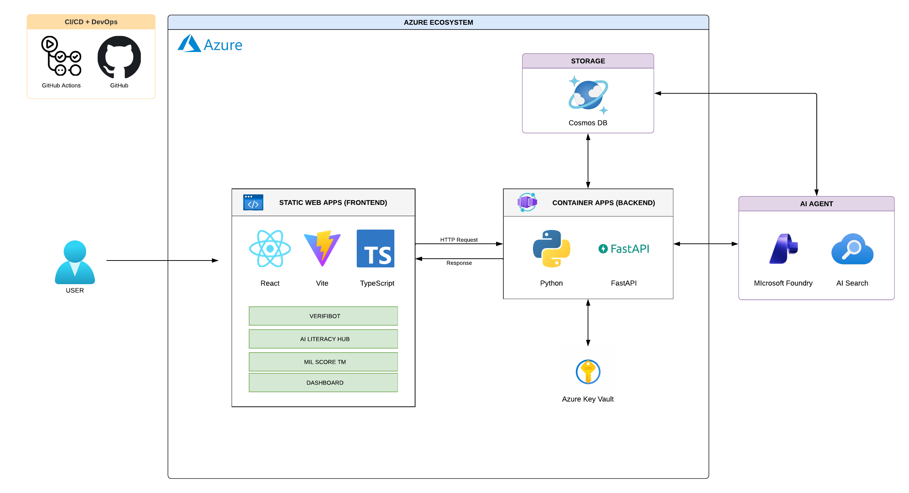

# VERIFIBOT

## Overview

VERIFIBOT is a Spanish-language educational fact-checking assistant built to help
students, teachers, and digital citizens verify claims before sharing them. It
combines Google Fact Check Tools API results, Azure OpenAI reasoning, and web
search evidence to return clear verdicts: `verdadera`, `falsa`,
`parcialmente correcta`, or `sin evidencia suficiente`.

The platform supports anonymous one-session use and secure accounts with
persistent chat history. Signed-in users can save, revisit, search, and delete
their verification conversations while the backend keeps credentials and
application secrets away from the browser.

## Demo


## Architecture



VERIFIBOT uses a decoupled web architecture designed for secure verification
workflows and repeatable Azure deployment.

- `frontend/`: React, TypeScript, and Vite interface for the chatbot, evidence
  panel, account flow, and chat history.
- `backend/`: FastAPI service for authentication, chat persistence, claim
  analysis, Google Fact Check API lookups, and Azure OpenAI calls.
- `infra/`: Bicep templates for Azure Static Web Apps, Azure Container Apps,
  Azure Container Registry, Microsoft Foundry, Azure AI Search, and Azure Cosmos
  DB for NoSQL.

Passwords are hashed with Argon2. The API issues signed bearer tokens and stores
user data in Azure Cosmos DB under the `/userId` partition so chat history is
scoped to the authenticated user.

## Business Impact

| Stakeholder | Concrete Problem | How VERIFIBOT Addresses It |
| --- | --- | --- |
| **Students** | Viral claims and misleading content are difficult to evaluate quickly | Returns concise verdicts with evidence-focused explanations in Spanish |
| **Teachers** | Digital literacy activities often require guided, repeatable verification workflows | Provides a classroom-friendly assistant for comparing claims against reliable sources |
| **Schools / Programs** | Media literacy tools need to be accessible without exposing private credentials | Supports anonymous use and secure accounts with backend-managed secrets |
| **Digital Citizens** | People need a simple way to pause before sharing uncertain information | Encourages evidence review and gives a direct `sin evidencia suficiente` outcome when proof is not enough |
| **Developers / Operators** | Fact-checking systems need auditable persistence and cloud-ready deployment | Uses Cosmos DB history, FastAPI boundaries, and Bicep infrastructure for repeatable Azure releases |

## Key Features

- **Evidence-first verdicts:** Uses published Google Fact Check ratings first,
  then web-search evidence through Azure OpenAI when the initial rating is not
  decisive.
- **Simple verdict taxonomy:** Limits results to `verdadera`, `falsa`,
  `parcialmente correcta`, and `sin evidencia suficiente` to keep the user
  experience understandable.
- **Spanish educational assistant:** Explains conclusions in concise Spanish and
  avoids long unsupported answers when evidence is inconclusive.
- **Persistent chat history:** Signed-in users can create, search, reopen, and
  delete individual chats or all chats.
- **Secure authentication:** Stores user credentials safely with Argon2 password
  hashing and signed JWT access tokens.
- **Cloud-ready deployment:** Infrastructure is described with Bicep for Azure
  Static Web Apps, Azure Container Apps, Microsoft Foundry, and Cosmos DB.

## Success Metrics

| Metric | Target / Expected Outcome | How It Is Measured |
| --- | --- | --- |
| **Verification Clarity** | Users receive one of four understandable verdicts | Ratio of responses mapped to the supported verdict taxonomy |
| **Evidence Coverage** | Claims use fact-check ratings when available and web evidence when needed | Presence of Google Fact Check sources or cited web-search sources in the analysis |
| **Inconclusive Handling** | Unsupported claims are not forced into true/false answers | Count of `sin evidencia suficiente` responses when reliable evidence is missing |
| **History Reliability** | Signed-in users can recover prior verification conversations | Successful reads and writes in the Cosmos DB `chats` container |
| **Account Safety** | User secrets never leave the backend | Password hashes only in storage, JWT-based browser sessions, and no service keys exposed client-side |
| **Deployment Repeatability** | Cloud resources can be recreated consistently | Successful Bicep validation and deployment of the Azure infrastructure |

## Run Everything Locally

### Backend

1. Create a `.env` file at the project root using the required Azure, Cosmos DB,
   OpenAI, and Google Fact Check values.
2. Create and activate a Python environment.
3. Install dependencies:

```powershell
cd backend
python -m venv .venv
.\.venv\Scripts\Activate.ps1
pip install -r requirements.txt
```

4. Start the API:

```powershell
fastapi dev main.py
```

Backend available at `http://localhost:8000`.

### Frontend

1. Install dependencies:

```powershell
cd frontend
npm install
```

2. Start the dev server:

```powershell
npm run dev
```

Frontend available at `http://localhost:5173`.

During local development, Vite proxies `/api/*` requests to the FastAPI backend.

## Azure Deployment

The infrastructure entry point is `infra/main.bicep`.

```powershell
az bicep build --file infra/main.bicep
az deployment sub create --name MAIN --location centralus --template-file infra/main.bicep
```

For detailed deployment notes, region selection, GitHub Actions secrets, and
troubleshooting, see `infra/README.md`.
